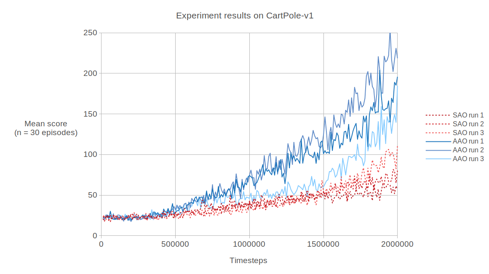
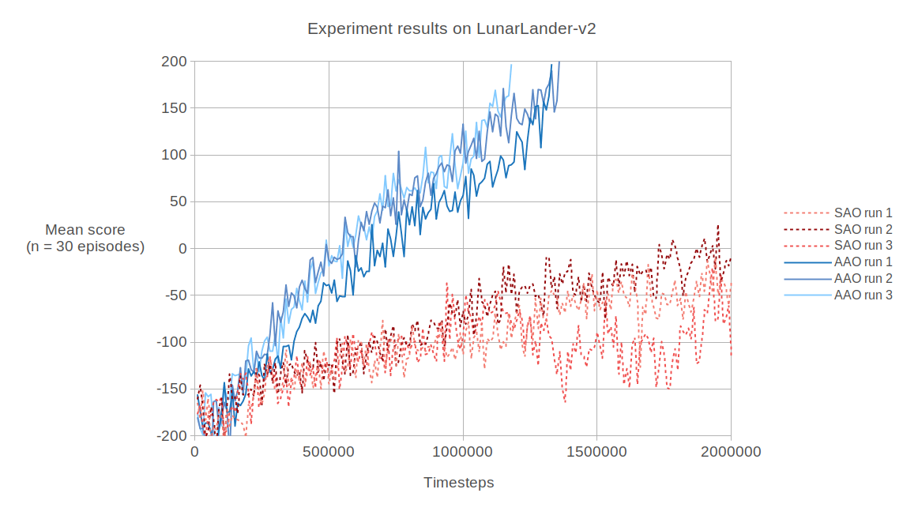
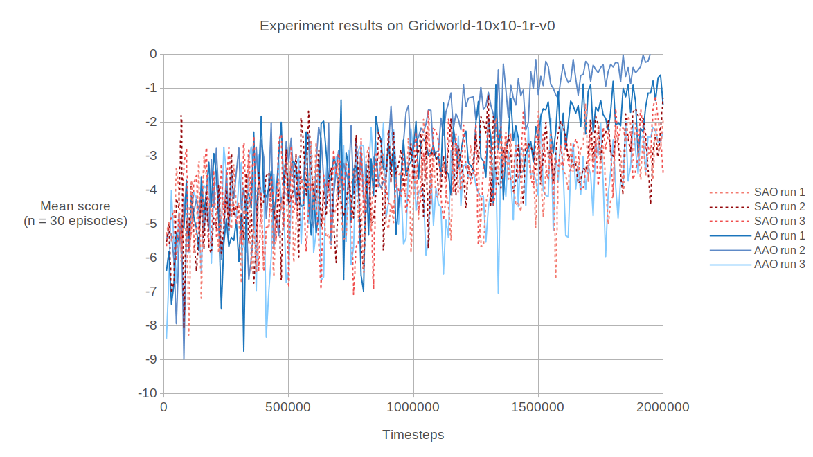

# Reinforcement Learning: All Actions Optimization

This reinforcement learning (RL) project seeked to implement, test, and compare a new, novel RL algorithm to a traditional
RL algorithm similar to One Step TD learning.

The complete paper is available [here]()

## Motivation

Existing deep reinforcement learning (DRL) methods can be costly to train agents, both in regards to money and time.
Even training an agent in a simple environment like Atari Breakout can take millions of timesteps to achieve humanlike performance.
Due to these costs, it remains an open problem within DRL and finding more efficient methods of training is highly desirable.

## All Actions Optimization

## Experiment

In order to determine the performance of the AAO algorithm, an experiment will be conducted to determine
learning efficiency compared to a more traditional algorithm.

### Baseline algorithm: SAO

### Environments

The experiment will test both the AAO and SAO algorithms on 3 environments: CartPole-v1, LunarLander-v2, and Gridworld-10x10-1r-v0.
These environments are simple enough that a few runs can be conducted feasibly and vary enough to determine the algorithm's general learning abilities.

CartPole-v1 is a simple environment that tasks the agent with manuevering a car along an axis such that a vertical pole is balanced on top of it.
This environment is often used to test DRL algorithm implementations and can be learned reasonably fast, making it a good starting point for this experiment.

LunarLander-v2 is a more complex environment that tasks the agent with landing a spacecraft onto a lunar surface. The agent has access to a set of thrusters
to fire and seeks to land the spacecraft safely in a designated area. This environment provides a slightly more difficult challenge to a DRL algorithm compared
to the CartPole-v1 environment.

Gridworld-10x10-1r-v0 is a simple environment that tasks the agent with navigating through a 10 by 10 grid to collect a single reward, which once collected, ends
the environment. Unlike the other environments, this environment contains a sparse reward function, which gives the agent 0 reward on all actions except for when
the sole reward is collected, when a reward of 1 is given. This sparse reward function provides another challenge for both the AAO and SAO algorithm in the
experiment.

CartPole-v1 and LunarLander-v2 are environments provided by OpenAI's Gym package. The Gridworld-10x10-1r-v0 is a custom environment that was made for this project,
and is implemented using the same Gym interface that the other two environments use.

### Learning efficiency

To compare the AAO and SAO algorithms in terms of learning efficiency, a specific metric must be created. Efficiency is often expressed as a fraction with the
numerator being some kind of performance, and with the denominator being some kind of resource being consumed. One example of this form include miles per gallon
(fuel efficiency).

Learning efficiency can be expressed as a change in score divided by a change in time, or how much the algorithm can improve a policy in a given amount of time.

Formally: Learning efficiency = Change in score / Change in time = (Trained policy score - random policy score) / (timesteps)

Where score refers to the average undiscounted rewards in an episode and a random policy is one which selects actions according to a random uniform distribution.

### Experimental setup

This experiment seeks to determine the mean learning efficiency of both the AAO and SAO algorithms. For each environment and algorithm, three runs will be conducted
to determine mean learning efficiency. A run is defined as training an agent starting from a random policy and ending when a high score is reached, or a timestep
limit is met, whichever comes first. Once a run is complete, the trained policy score and timesteps encountered are recorded, and the learning efficiency sample can
be calculated.

Additionally, score over time plots will also be produced, providing a useful visualization for the experiment results on all 3 environments.

## Results and Discussion

### CartPole-v1

AAO Results

| Run Number | Mean score achieved | Number of timesteps | Learning efficiency |
| ---------- | ------------------- | ------------------- | ------------------- |
|      1     | 196 | 2,000,000 | 8.65 * 10^-5 |
|      2     | 219 | 2,000,000 | 9.8 * 10^-5  |
|      3     | 185 | 2,000,000 | 8.1 * 10^-5  |

SAO Results

| Run Number | Mean score achieved | Number of timesteps | Learning efficiency |
| ---------- | ------------------- | ------------------- | ------------------- |
|      1     | 57 | 2,000,000 | 1.7 * 10^-5 |
|      2     | 80 | 2,000,000 | 2.85 * 10^-5  |
|      3     | 111 | 2,000,000 | 4.4 * 10^-5  |

Under similar conditions, the AAO algorithm achieved a mean learning efficiency of 8.85 * 10^-5 over 3 runs, while the
SAO algorithm achieved a mean learning efficiency of 2.98 * 10^-5 over 3 runs.

The mean learning efficiency ratio is then 8.85 * 10^-5 / 2.98 * 10^-5 = approximately 2.97.

This suggests that the AAO algorithm is 197% more learning efficient on the CartPole-v1 environment under similar conditions.

### LunarLander-v2

AAO Results

| Run Number | Mean score achieved | Number of timesteps | Learning efficiency |
| ---------- | ------------------- | ------------------- | ------------------- |
|      1     | 197 | 1,330,000 | 2.73 * 10^-4 |
|      2     | 207 | 1,360,000 | 2.74 * 10^-4 |
|      3     | 197 | 1,180,000 | 3.07 * 10^-4  |

SAO Results

| Run Number | Mean score achieved | Number of timesteps | Learning efficiency |
| ---------- | ------------------- | ------------------- | ------------------- |
|      1     | -34 | 2,000,000 | 6.6 * 10^-5 |
|      2     | -7 | 2,000,000 | 7.95 * 10^-5  |
|      3     | -115 | 2,000,000 | 2.55 * 10^-5  |

Under similar conditions, the AAO algorithm achieved a mean learning efficiency of 2.85 * 10^-4 over 3 runs, while the
SAO algorithm achieved a mean learning efficiency of 5.7 * 10^-4 over 3 runs.

The mean learning efficiency ratio is then 2.85 * 10^-4 / 5.7 * 10^-4 = 5.

This suggests that the AAO algorithm is 400% more learning efficient on the LunarLander-v2 environment under similar conditions.

### Gridworld-10x10-1r-v0

AAO Results

| Run Number | Mean score achieved | Number of timesteps | Learning efficiency |
| ---------- | ------------------- | ------------------- | ------------------- |
|      1     | -1.491 | 2,000,000 | 1.308 * 10^-6 |
|      2     | 0.035 | 1,950,000 | 2.124 * 10^-6 |
|      3     | -2.28 | 2,000,000 | 9.135 * 10^-7  |

SAO Results

| Run Number | Mean score achieved | Number of timesteps | Learning efficiency |
| ---------- | ------------------- | ------------------- | ------------------- |
|      1     | -1.942 | 2,000,000 | 1.08 * 10^-6 |
|      2     | -1.277 | 2,000,000 | 1.415 * 10^-6  |
|      3     | -3.573 | 2,000,000 | 2.67 * 10^-7  |

Under similar conditions, the AAO algorithm achieved a mean learning efficiency of 1.449 * 10^-6 over 3 runs, while the
SAO algorithm achieved a mean learning efficiency of 9.207 * 10^-7 over 3 runs.

The mean learning efficiency ratio is then 1.449 * 10^-6 / 9.207 * 10^-7 = approximately 1.574.

This suggests that the AAO algorithm is 57.4% more learning efficient on the Gridworld-10x10-1r-v0 environment under similar conditions.

## Conclusion

Based on the results of these 3 experiments, the All Actions Optimization algorithm looks promising for achieving a higher level of learning efficiency
compared to traditional model free reinforcement learning algorithms.

Strangely, the learning efficiency ratio for the Gridworld-10x10-1r-v0 environment
did not appear as high as the other environments, which could be worth investigation in future experiments.
To improve confidence in the All Actions Optimization algorithm, it may be worth applying the experimental methodology in this project to many more environments, and collect more runs.

## How to run